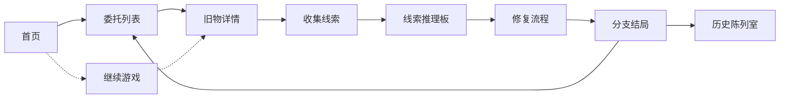

## 1. 产品概述

记忆修复店是一款叙事轻解谜网页游戏，玩家扮演记忆修复师，通过修复客户带来的旧物来还原失落的记忆。游戏融合了物件收集、线索推理和分支叙事，营造出温暖治愈的氛围。

- **核心玩法**：接受委托 → 检视旧物 → 收集线索 → 推理修复 → 达成结局
- **目标用户**：喜欢叙事解谜、治愈系游戏的玩家
- **产品价值**：通过碎片化叙事和物件互动，讲述触动人心的故事

## 2. 核心功能

### 2.1 用户角色
| 角色 | 进入方式 | 核心权限 |
|------|----------|----------|
| 修复师 | 直接进入 | 接受委托、修复旧物、查看历史、存档读档 |

### 2.2 功能模块
1. **委托列表**：展示待接取和进行中的委托，包含客户信息、委托简介、难度标签
2. **旧物详情**：360°检视旧物，点击热点区域发现线索，记录关键信息
3. **线索推理板**：收集的线索以卡片形式呈现，可拖拽关联，推理出修复方案
4. **修复流程**：根据推理结果选择修复方式，观看修复动画，解锁记忆片段
5. **分支结局**：根据修复选择触发不同结局，记录已达成结局
6. **历史陈列室**：展示已完成的委托和修复好的旧物，可回顾故事
7. **继续游戏**：自动保存进度，支持从上次中断处继续

### 2.3 页面详情
| 页面名称 | 模块名称 | 功能描述 |
|----------|----------|----------|
| 首页 | 店铺招牌、开始/继续按钮、陈列室入口 | 游戏入口，展示店铺氛围 |
| 委托列表 | 委托卡片、筛选标签、进度指示器 | 浏览和选择委托 |
| 旧物详情 | 旧物展示区、热点标记、线索笔记 | 检视旧物、收集线索 |
| 线索推理板 | 线索卡片、连线画布、推理结论 | 关联线索、推导修复方案 |
| 修复流程 | 修复步骤、选择分支、进度条 | 执行修复、触发结局 |
| 结局展示 | 结局画面、故事文本、回溯按钮 | 呈现结局、允许重玩 |
| 历史陈列室 | 旧物展柜、故事回顾、结局收集 | 浏览已完成内容 |

## 3. 核心流程

玩家从首页进入游戏，选择委托后检视旧物、收集线索，通过推理板关联线索得出修复方案，执行修复后触发结局，完成的委托存入陈列室。游戏自动存档，支持随时继续。

## 4. 用户界面设计

### 4.1 设计风格
- **主色调**：暖棕色系（#8B6914 主色）、米白（#F5EFE0 背景）、深棕（#3D2914 文字）
- **点缀色**：旧金色（#D4AF37）、墨绿（#2F4F4F）
- **设计风格**：复古温馨、手账质感、偏插画风格
- **按钮样式**：圆角矩形、微浮雕质感、hover 有微光效果
- **字体**：标题使用衬线字体（如 Noto Serif SC），正文使用圆润无衬线
- **布局**：卡片式布局、留有大量呼吸空间、类似笔记本/手账的视觉感受
- **动效**：柔和的淡入淡出、纸张翻页效果、物件悬浮微动

### 4.2 页面设计概述
| 页面名称 | 模块名称 | UI元素 |
|----------|----------|--------|
| 首页 | 店铺招牌 | 木质招牌质感、暖光效果、微动效 |
| 委托列表 | 委托卡片 | 便签纸样式、不同颜色代表不同类型、撕下动效 |
| 旧物详情 | 旧物展示 | 聚光效果、热点发光脉冲、点击反馈 |
| 线索推理板 | 线索卡片 | 拍立得/照片样式、可拖拽、连线为细绳效果 |
| 修复流程 | 修复进度 | 进度条类似针线缝制、步骤图标化 |
| 结局展示 | 结局画面 | 全屏渐显、文字打字机效果、暖色调滤镜 |
| 历史陈列室 | 展柜 | 玻璃展柜质感、聚光灯效果、尘埃粒子 |

### 4.3 响应式
- 桌面端优先，适配平板和移动端
- 移动端采用单列布局，推理板改为纵向排列
- 触控优化：增大点击区域，支持滑动操作

### 4.4 氛围与细节
- 背景使用细腻的纸张纹理
- 加入微妙的噪点和颗粒感
- 场景切换使用淡入淡出+模糊过渡
- 适当加入柔光和光斑效果增强氛围感
