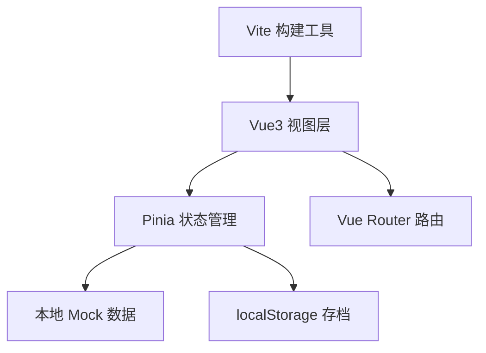
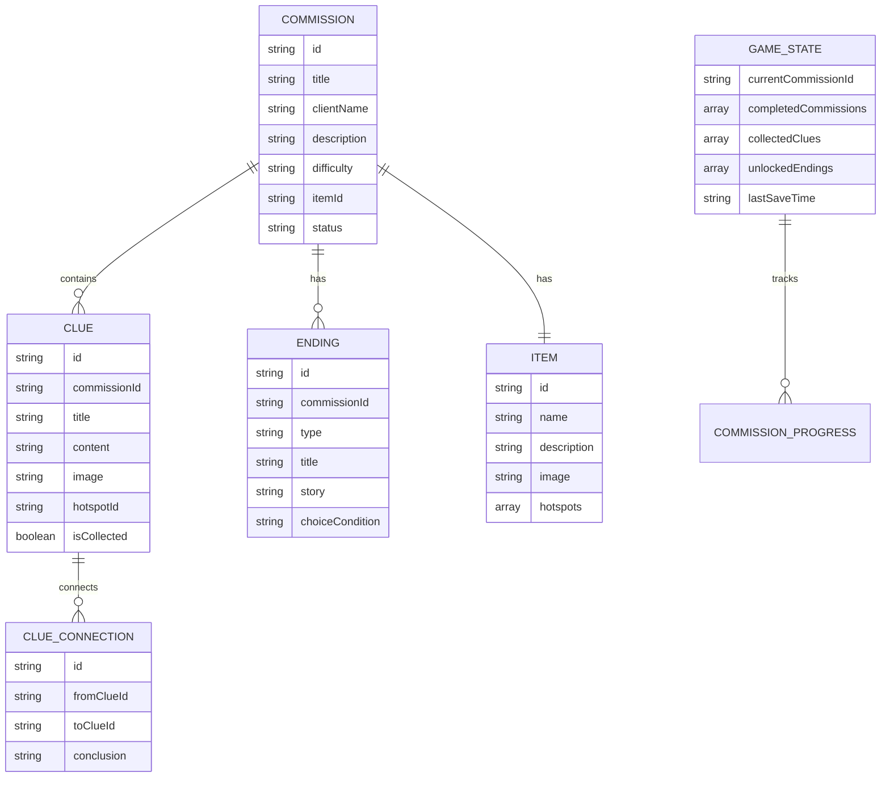

## 1. 架构设计

本项目为纯前端单页应用，采用 Vue3 + Vite 构建，使用 Pinia 进行状态管理，Vue Router 处理路由。所有游戏数据采用本地 mock 数据，存档通过 localStorage 持久化，无需后端服务。



## 2. 技术描述

- **前端框架**：Vue@3.5 + TypeScript
- **构建工具**：Vite@5
- **状态管理**：Pinia@2
- **路由管理**：Vue Router@4
- **样式方案**：TailwindCSS@3
- **图标库**：Lucide Vue
- **数据存储**：localStorage（存档） + 本地 JSON（游戏数据）
- **初始化方式**：vite-init vue-ts 模板

## 3. 路由定义

| 路由路径 | 页面名称 | 说明 |
|----------|----------|------|
| / | 首页 | 游戏入口，开始/继续游戏 |
| /commissions | 委托列表 | 浏览所有委托 |
| /commission/:id | 旧物详情 | 检视当前委托的旧物 |
| /deduction/:id | 线索推理板 | 关联线索推理修复方案 |
| /repair/:id | 修复流程 | 执行修复操作 |
| /ending/:id/:endingType | 结局展示 | 呈现分支结局 |
| /gallery | 历史陈列室 | 浏览已完成的委托 |

## 4. 数据模型

### 4.1 数据模型定义



### 4.2 状态管理（Pinia）

- **useGameStore**：全局游戏状态，包含存档、进度、收集品
- **useCommissionStore**：委托相关状态，当前委托、线索列表
- **useRepairStore**：修复流程状态，修复步骤、选择分支

## 5. 项目结构

```
src/
├── assets/          # 静态资源（图片、样式）
├── components/      # 通用组件
│   ├── CommissionCard.vue
│   ├── ClueCard.vue
│   ├── ItemViewer.vue
│   └── ...
├── composables/     # 组合式函数
│   ├── useSaveGame.ts
│   └── useAnimation.ts
├── data/            # Mock 数据
│   ├── commissions.ts
│   ├── clues.ts
│   └── endings.ts
├── pages/           # 页面组件
│   ├── Home.vue
│   ├── CommissionList.vue
│   ├── ItemDetail.vue
│   ├── DeductionBoard.vue
│   ├── RepairProcess.vue
│   ├── EndingView.vue
│   └── Gallery.vue
├── router/          # 路由配置
│   └── index.ts
├── stores/          # Pinia 状态
│   ├── game.ts
│   ├── commission.ts
│   └── repair.ts
├── types/           # TypeScript 类型
│   └── index.ts
├── utils/           # 工具函数
│   └── storage.ts
├── App.vue
└── main.ts
```

## 6. 存档机制

- 使用 localStorage 存储游戏进度
- 自动存档：关键节点自动保存（收集线索、完成委托等）
- 存档数据结构版本化，便于后续升级
- 支持多存档位（可选）
